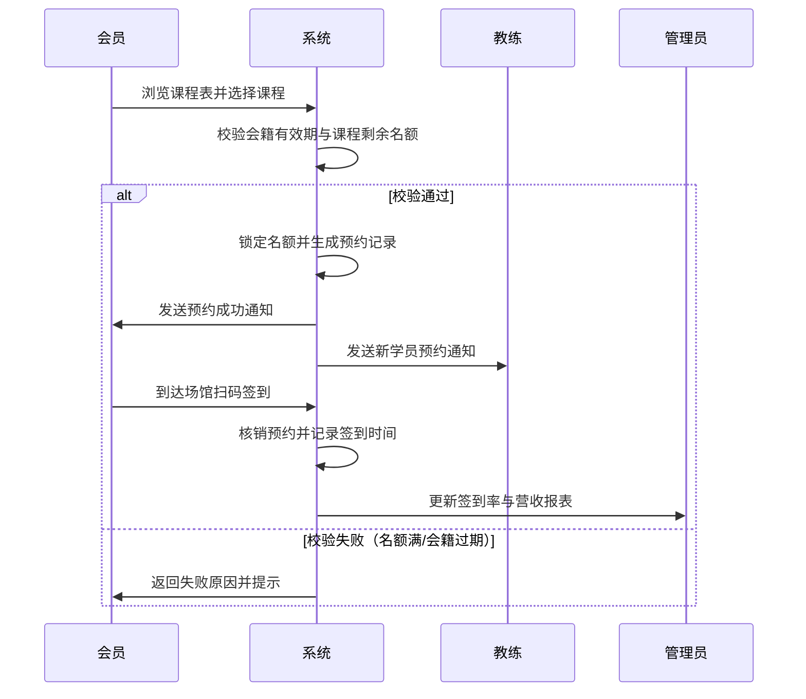

# Microservices-practice-2412190217

## **微服务开发与实践**

俞哲 2412190217 计科2402
本仓库用于后续提交作业

# 椰汁健身房会员管理系统

## 项目简介

椰汁健身房会员管理系统是一个面向现代健身房的综合性会员管理与服务预约平台。项目致力于为健身房提供一套从会员入会、课程购买、预约签到到教练管理的全流程数字化解决方案。

## 业务背景

随着全民健身意识的提升，传统健身房依靠纸质登记或 Excel 表格管理会员、排课和签到的方式已无法满足高效运营的需求。特别是在高峰期，会员排队签到、课程约满冲突、教练排班混乱等问题频发。因此，构建一个支持多角色协同、数据实时同步的健身房管理系统具有强烈的现实业务价值。

## 目标用户及需求

1. **健身房会员**：需要在线查看课程表、预约私教/团课、扫码签到、查看剩余次数/会籍有效期、购买续费。
2. **私人教练/团课教练**：需要查看个人排班、管理所授课程、确认会员预约、记录会员体测数据。
3. **场馆管理员**：需要管理会员信息、教练排班、课程发布、财务流水统计、器材/场地状态维护。

## 功能设计（初步边界）

- **用户中心**：会员/教练/管理员的注册、登录、个人信息管理。
- **课程与排班**：课程发布、教练排班、课程容量控制。
- **预约与签到**：会员在线预约课程、取消预约、线下扫码/手动签到。
- **会籍与订单**：会员卡类型管理、续费充值、订单记录。
- **数据统计**：管理员查看每日签到率、课程满员率、营收报表。

## 后续演进方向

本项目将作为本学期持续演进的唯一项目，计划按以下阶段迭代：

1. **阶段一（当前）**：需求分析与功能规划，完成 README 和项目骨架搭建。
2. **阶段二**：数据库设计与持久化，实现核心业务实体的 CRUD。
3. **阶段三**：服务拆分与微服务架构改造，引入认证授权。
4. **阶段四**：引入消息队列处理预约通知，使用分布式事务保证扣费与预约的一致性。
5. **阶段五**：完善监控、日志与容器化部署（Docker）。


## 项目目标和适用场景

**项目目标**：构建一套面向现代健身房的综合性数字化管理平台，解决传统健身房在会员管理、课程预约、签到及财务统计中依赖人工、效率低下的痛点，提升场馆运营效率和会员健身体验。
**适用场景**：适用于中小型单体健身房、连锁健身房门店，覆盖从会员入会、购买会籍、预约课程、现场签到到教练排班、管理员数据统计的全流程业务。

## 主要用户角色及需求


| 用户角色   | 核心需求                                                                                |
| :--------- | :-------------------------------------------------------------------------------------- |
| **会员**   | 在线查看课程表、预约/取消私教或团课、扫码签到、查看会籍有效期与剩余次数、在线续费充值。 |
| **教练**   | 查看个人排班与授课表、确认会员预约、记录会员体测数据、查看课时统计。                    |
| **管理员** | 管理会员与教练信息、发布课程与排班、查看营收流水与签到率报表、维护场馆器材/场地状态。   |

## 功能模块划分及具体功能


| 模块名称       | 具体功能                                                                 |
| :------------- | :----------------------------------------------------------------------- |
| **用户中心**   | 会员/教练/管理员的注册、登录、个人信息维护、权限控制。                   |
| **课程与排班** | 课程发布、教练排班、课程容量设置、课程状态管理（未开始/进行中/已结束）。 |
| **预约与签到** | 会员在线预约、取消预约、名额校验、扫码签到、手动签到。                   |
| **会籍与订单** | 会员卡类型管理、续费充值、订单生成、支付状态流转、退款处理。             |
| **数据统计**   | 每日签到率、课程满员率、营收报表、教练课时统计。                         |

## 核心业务流程（会员预约课程）

以下为系统中最典型的核心业务流程，后续可基于此流程引入分布式锁、消息通知和分布式事务。




## 当前项目范围和暂不实现的内容

* **当前项目范围（本学期内）**：完成需求分析与功能规划、数据库设计与持久化、核心业务模块的 CRUD 实现、基础认证授权。
* **暂不实现的内容**：暂不涉及真实支付渠道对接（使用模拟支付）、暂不涉及硬件门禁/闸机对接、暂不涉及多租户 SaaS 化改造。

## 后续可扩展的演进方向


| 演进方向     | 具体内容                                                         |
| ------------ | ---------------------------------------------------------------- |
| **认证**     | 引入 JWT + Spring Security，实现多角色细粒度权限控制。           |
| **服务拆分** | 将用户、课程、订单、签到等模块拆分为独立微服务。                 |
| **消息**     | 引入 RocketMQ/RabbitMQ，实现预约通知、签到提醒、营销推送。       |
| **事务**     | 引入 Seata 或本地消息表，保证“扣费 + 预约”的分布式事务一致性。 |
| **监控**     | 引入 Prometheus + Grafana，监控服务健康度与业务指标。            |
| **部署**     | 使用 Docker + Kubernetes 实现容器化编排与自动化部署。            |

## 项目结构与运行方式（阶段一）

```
仓库根目录/
├── monolith/          # 阶段一：Spring Boot 单体应用（Maven 工程）
│   ├── pom.xml
│   ├── mvnw / mvnw.cmd
│   └── src/           # 源码与测试代码（包名 com.zjgsu.yz）
├── docs/
│   ├── homework/      # 历次作业记录
│   └── project-proposal.md   # 项目立项说明
└── README.md
```

**技术栈**：Java 21（LTS）+ Spring Boot 4.0.x + Maven（`mvnw` 包装器）

```bash
cd monolith

# 运行测试
./mvnw test                # Windows 下使用 .\mvnw.cmd test

# 启动应用（默认端口 8080）
./mvnw spring-boot:run     # Windows 下使用 .\mvnw.cmd spring-boot:run
```

**验证接口**：

- `GET http://localhost:8080/api/ping` → `{"status":"UP","app":"gym","time":"..."}`
- `GET http://localhost:8080/actuator/health` → `{"status":"UP",...}`
